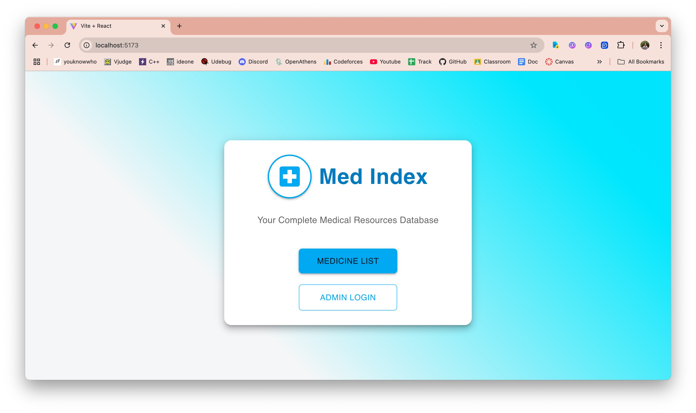
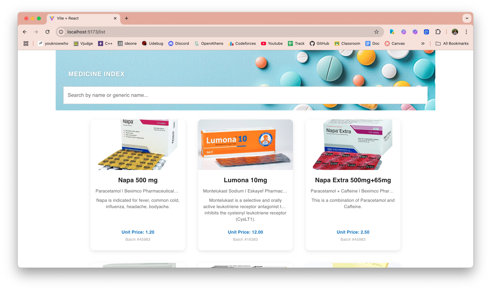
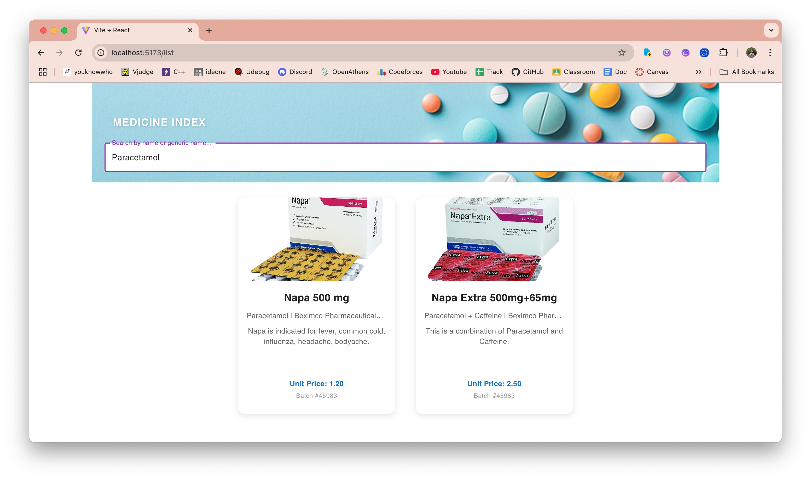
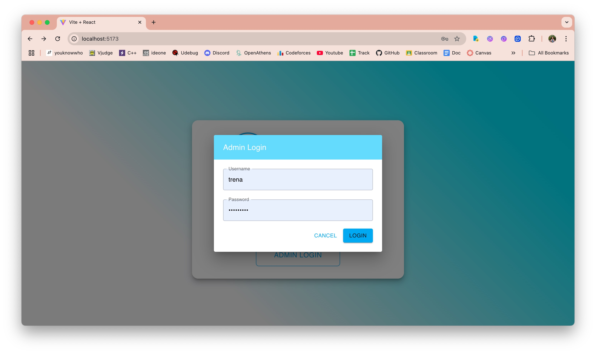
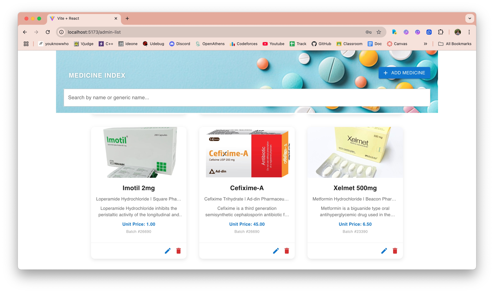
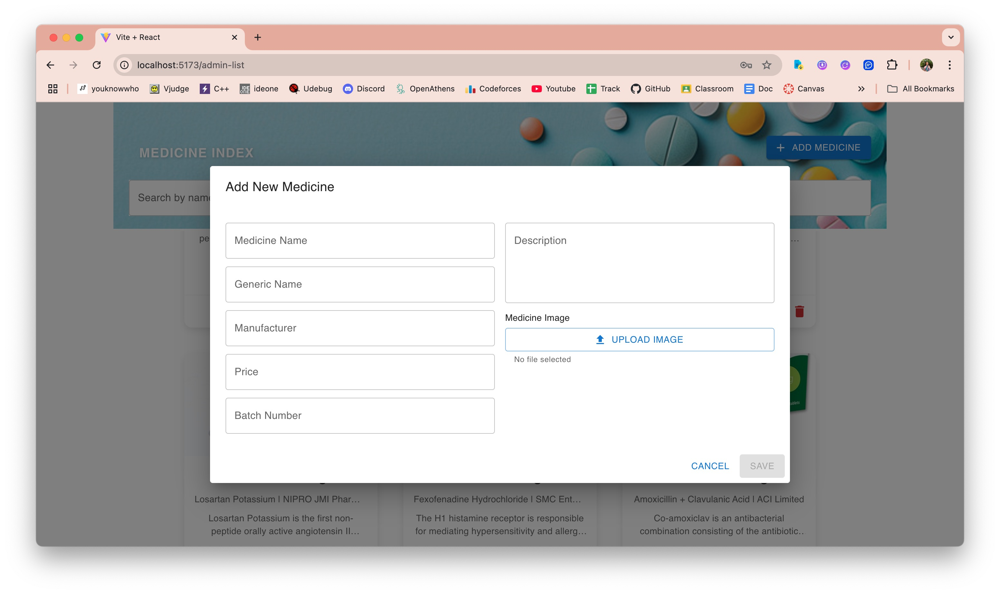
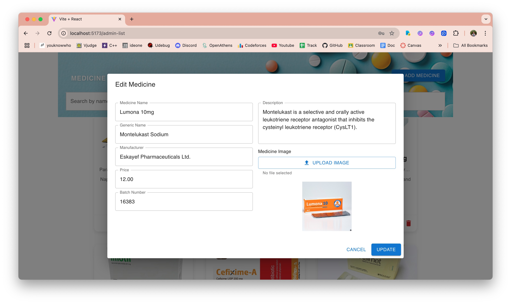
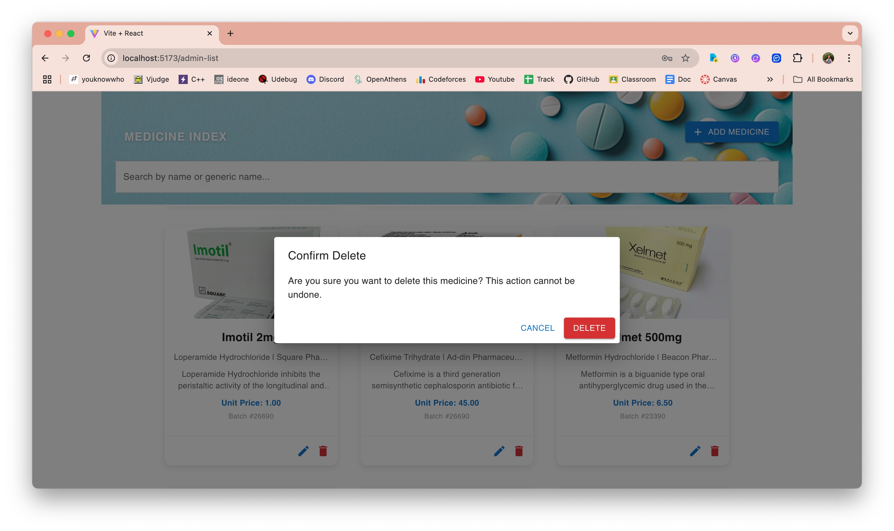

# medIndex

This is a simple project where visitor can search and view a list of medicines in the system and admin can access dashboard.

## Steps to run the project locally

- system must have node js & npm installed
- clone the repository, go to project directory, run following commads sequentially
- `npm install` -> to install all the dependencies
- `npm run dev` -> will run the frontend server
- create a .env file and put the backend server URL as
  `VITE_API_URL=http://127.0.0.1:8000/api/meds/`
  `VITE_API_LOGIN_URL=http://127.0.0.1:8000/api/login/`

## Project Functionalities

<figure>
  
  <figcaption>Landing Page</figcaption>
</figure>

<figure>
  
  <figcaption>Medicine List Page</figcaption>
</figure>

<figure>
  
  <figcaption>Medicine Search Functionality</figcaption>
</figure>

<figure>
  
  <figcaption>Admin Login</figcaption>
</figure>

<figure>
  
  <figcaption>Admin Dashboard</figcaption>
</figure>

<figure>
  
  <figcaption>Create Medicine Functionality</figcaption>
</figure>

<figure>
  
  <figcaption>Edit Medicine Functionality</figcaption>
</figure>

<figure>
  
  <figcaption>Delete Medicine Functionality</figcaption>
</figure>
